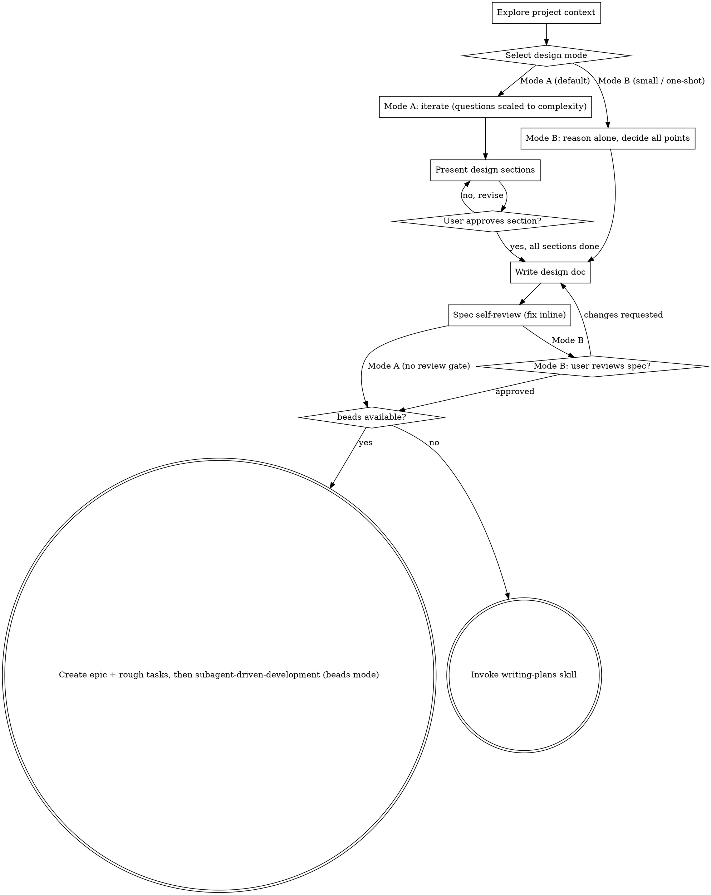

# Brainstorming Ideas Into Designs

Help turn ideas into fully formed designs and specs through natural collaborative dialogue.

Start by understanding the current project context, then ask questions one at a time to refine the idea. Once you understand what you're building, present the design and get user approval.

<HARD-GATE>
Do NOT invoke any implementation skill, write any code, scaffold any project, or take any implementation action until you have presented a design and the user has approved it. This applies to EVERY project regardless of perceived simplicity.
</HARD-GATE>

## Anti-Pattern: "This Is Too Simple To Need A Design"

Every project goes through this process. A todo list, a single-function utility, a config change — all of them. "Simple" projects are where unexamined assumptions cause the most wasted work. The design can be short (a few sentences for truly simple projects), but you MUST present it and get approval.

## Design Modes

Brainstorming runs in one of two modes. Choose the mode at the start, before asking anything.

**Mode A — Collaborative (default).** Iterate through the design with the user, one question at a time. Scale the number of questions to the design's complexity: small designs need few questions; large or ambiguous designs warrant more. Explicitly cover every ambiguous or contentious part before presenting the design. Get per-section approval as you present. Once you have iterated through the whole design together, do **not** ask the user to review the written spec — proceed directly to the next step.

**Mode B — One-shot (no questions).** Do not ask the user anything. Reason alone: identify every decision point, propose options for each, pick one, and write the entire spec in a single pass using the Mode B spec structure (see "After the Design"). After writing the spec, ask the user to review it before proceeding.

**Mode selection.** Default to Mode A. Use Mode B when the design complexity is small, or the user explicitly asks for a "one shot design".

The review gate is inverted between modes: Mode A has no final-spec review (you reviewed together as you went); Mode B requires one (the user saw nothing until the spec was written).

## Checklist

You MUST create a task for each of these items and complete them in order:

1. **Explore project context** — check files, docs, recent commits
2. **Select design mode** — Mode A (collaborative, default) or Mode B (one-shot); see Design Modes above
3. **Offer visual companion** (if topic will involve visual questions) — this is its own message, not combined with a clarifying question. See the Visual Companion section below.
4. **Ask clarifying questions** *(Mode A only)* — one at a time, scaled to complexity, covering every ambiguous/contentious part
5. **Propose 2-3 approaches** — with trade-offs and your recommendation *(Mode A presents these to the user; Mode B decides alone)*
6. **Present design** *(Mode A only)* — in sections scaled to their complexity, get user approval after each section
7. **Write design doc** — save to `docs/superpowers/specs/YYYY-MM-DD-<topic>-design.md` and commit (Mode B uses the one-shot spec structure)
8. **Spec self-review** — quick inline check for placeholders, contradictions, ambiguity, scope (see below)
9. **User reviews written spec** *(Mode B only)* — ask the user to review the spec file before proceeding
10. **Transition to implementation** — beads available → create epic + rough tasks, then subagent-driven-development (beads mode); otherwise → writing-plans

## Process Flow

**The terminal state is either the beads execution flow or writing-plans** (depending on whether the `bd` CLI is available). Do NOT invoke frontend-design, mcp-builder, or any other implementation skill — only the two terminal states above.

## The Process

**Understanding the idea:**

- Check out the current project state first (files, docs, recent commits)
- Before asking detailed questions, assess scope: if the request describes multiple independent subsystems (e.g., "build a platform with chat, file storage, billing, and analytics"), flag this immediately. Don't spend questions refining details of a project that needs to be decomposed first.
- If the project is too large for a single spec, help the user decompose into sub-projects: what are the independent pieces, how do they relate, what order should they be built? Then brainstorm the first sub-project through the normal design flow. Each sub-project gets its own spec → plan → implementation cycle.
- For appropriately-scoped projects, ask questions one at a time to refine the idea
- Prefer multiple choice questions when possible, but open-ended is fine too
- Only one question per message - if a topic needs more exploration, break it into multiple questions
- Focus on understanding: purpose, constraints, success criteria

**Exploring approaches:**

- Propose 2-3 different approaches with trade-offs
- Present options conversationally with your recommendation and reasoning
- Lead with your recommended option and explain why

**Presenting the design:**

- Once you believe you understand what you're building, present the design
- Scale each section to its complexity: a few sentences if straightforward, up to 200-300 words if nuanced
- Ask after each section whether it looks right so far
- Cover: architecture, components, data flow, error handling, testing
- Be ready to go back and clarify if something doesn't make sense

**Design for isolation and clarity:**

- Break the system into smaller units that each have one clear purpose, communicate through well-defined interfaces, and can be understood and tested independently
- For each unit, you should be able to answer: what does it do, how do you use it, and what does it depend on?
- Can someone understand what a unit does without reading its internals? Can you change the internals without breaking consumers? If not, the boundaries need work.
- Smaller, well-bounded units are also easier for you to work with - you reason better about code you can hold in context at once, and your edits are more reliable when files are focused. When a file grows large, that's often a signal that it's doing too much.

**Working in existing codebases:**

- Explore the current structure before proposing changes. Follow existing patterns.
- Where existing code has problems that affect the work (e.g., a file that's grown too large, unclear boundaries, tangled responsibilities), include targeted improvements as part of the design - the way a good developer improves code they're working in.
- Don't propose unrelated refactoring. Stay focused on what serves the current goal.

## After the Design

**Documentation:**

- Write the validated design (spec) to `docs/superpowers/specs/YYYY-MM-DD-<topic>-design.md`
  - (User preferences for spec location override this default)
- Use elements-of-style:writing-clearly-and-concisely skill if available
- Commit the design document to git

**Spec Self-Review:**
After writing the spec document, look at it with fresh eyes:

1. **Placeholder scan:** Any "TBD", "TODO", incomplete sections, or vague requirements? Fix them.
2. **Internal consistency:** Do any sections contradict each other? Does the architecture match the feature descriptions?
3. **Scope check:** Is this focused enough for a single implementation plan, or does it need decomposition?
4. **Ambiguity check:** Could any requirement be interpreted two different ways? If so, pick one and make it explicit.

Fix any issues inline. No need to re-review — just fix and move on.

**Mode B Spec Structure:**
When writing the spec in Mode B, use this structure:

1. **Problem description** — one paragraph.
2. **Main challenges** — one paragraph.
3. **Key decisions made** — one paragraph.
4. **Decision points, by section** — one paragraph per decision point, each stating the recommended approach (and why it was chosen) and the considered approaches (and why they were discarded).

Mode A specs follow the normal section-by-section structure that emerged during the collaborative design.

**User Review Gate (Mode B only):**
In Mode B the user has not seen the design until now, so ask them to review the written spec before proceeding:

> "Spec written and committed to `<path>`. Please review it and let me know if you want to make any changes before we start implementation."

Wait for the user's response. If they request changes, make them and re-run the spec review loop. Only proceed once the user approves.

In Mode A, skip this gate — you already reviewed the design with the user section by section. Proceed directly to implementation.

**Implementation:**

Branch on beads availability (the `bd` CLI on PATH):

- **beads available:** Do NOT write a monolithic implementation plan.
  1. Ensure a beads database exists: if the repo has no `.beads` directory, run `bd init`.
  2. Create one epic issue for the whole spec. Capture its id. (Confirm the right issue type/flags for an epic with `bd create --help`.)
  3. Split the spec into rough child tasks — title + short description + a files-touched hint each — and create them under the epic with blocking dependencies so `bd ready` reflects real ordering. Prefer building the whole graph atomically with `bd create --graph <plan.json>`; otherwise create each task nested under the epic (`--parent <epic-id>`) and wire dependencies with `bd dep`. Confirm exact flags with `bd create --help` and `bd dep --help`.
  4. Invoke `superpowers:subagent-driven-development` in beads mode to execute the epic.
- **beads unavailable:** Invoke the `writing-plans` skill to create a detailed implementation plan.

Do NOT invoke any other skill.

## Key Principles

- **One question at a time** - Don't overwhelm with multiple questions
- **Multiple choice preferred** - Easier to answer than open-ended when possible
- **YAGNI ruthlessly** - Remove unnecessary features from all designs
- **Explore alternatives** - Always propose 2-3 approaches before settling
- **Incremental validation** - Present design, get approval before moving on
- **Be flexible** - Go back and clarify when something doesn't make sense

## Visual Companion

A browser-based companion for showing mockups, diagrams, and visual options during brainstorming. Available as a tool — not a mode. Accepting the companion means it's available for questions that benefit from visual treatment; it does NOT mean every question goes through the browser.

**Offering the companion:** When you anticipate that upcoming questions will involve visual content (mockups, layouts, diagrams), offer it once for consent:
> "Some of what we're working on might be easier to explain if I can show it to you in a web browser. I can put together mockups, diagrams, comparisons, and other visuals as we go. This feature is still new and can be token-intensive. Want to try it? (Requires opening a local URL)"

**This offer MUST be its own message.** Do not combine it with clarifying questions, context summaries, or any other content. The message should contain ONLY the offer above and nothing else. Wait for the user's response before continuing. If they decline, proceed with text-only brainstorming.

**Per-question decision:** Even after the user accepts, decide FOR EACH QUESTION whether to use the browser or the terminal. The test: **would the user understand this better by seeing it than reading it?**

- **Use the browser** for content that IS visual — mockups, wireframes, layout comparisons, architecture diagrams, side-by-side visual designs
- **Use the terminal** for content that is text — requirements questions, conceptual choices, tradeoff lists, A/B/C/D text options, scope decisions

A question about a UI topic is not automatically a visual question. "What does personality mean in this context?" is a conceptual question — use the terminal. "Which wizard layout works better?" is a visual question — use the browser.

If they agree to the companion, read the detailed guide before proceeding:
`skills/brainstorming/visual-companion.md`
