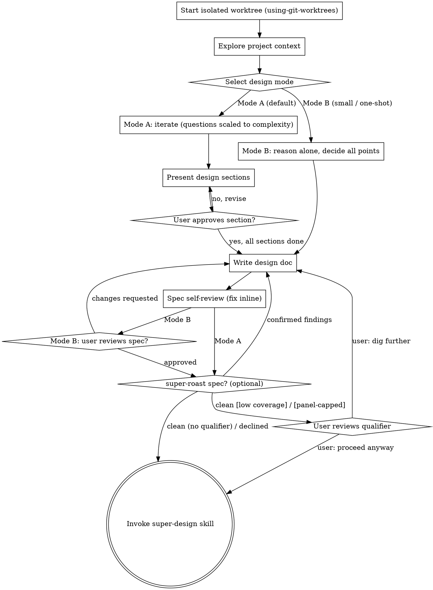

# Brainstorming Ideas Into Designs

Help turn ideas into fully formed designs and specs through natural collaborative dialogue.

Start by understanding the current project context, then ask questions one at a time to refine the idea. Once you understand what you're building, present the design and get user approval.

<HARD-GATE>
Do NOT invoke any implementation skill, write any code, scaffold any project, or take any implementation action until you have presented a design and the user has approved it. This applies to EVERY project regardless of perceived simplicity.
</HARD-GATE>

## Anti-Pattern: "This Is Too Simple To Need A Design"

Every project goes through this process. A todo list, a single-function utility, a config change — all of them. "Simple" projects are where unexamined assumptions cause the most wasted work. The design can be short (a few sentences for truly simple projects), but you MUST present it and get approval.

## Design Modes

Brainstorming runs in one of two modes. Choose the mode at the start, before asking anything.

**Mode A — Collaborative (default).** Iterate through the design with the user, one question at a time. Scale the number of questions to the design's complexity: small designs need few questions; large or ambiguous designs warrant more. Explicitly cover every ambiguous or contentious part before presenting the design. Get per-section approval as you present. Once you have iterated through the whole design together, do **not** ask the user to review the written spec — proceed directly to the next step.

**Mode B — One-shot (no questions).** Do not ask the user anything. Reason alone: identify every decision point, propose options for each, pick one, and write the entire spec in a single pass using the Mode B spec structure (see "After the Design"). After writing the spec, ask the user to review it before proceeding.

**Mode selection.** Default to Mode A. Use Mode B when the design complexity is small, or the user explicitly asks for a "one shot design".

The review gate is inverted between modes: Mode A has no final-spec review (you reviewed together as you went); Mode B requires one (the user saw nothing until the spec was written).

## Nested Invocation

`superpowers:super-design` can invoke brainstorming on a promoted subepic instead of a user invoking it at the root. When invoked this way, the process above still applies, with these deltas:

- **Inherit the session's design mode** (Mode A parent → Mode A subepic; Mode B → Mode B). The user may override per-subepic with an explicit request.
- **Context is handed in by the invoking super-design**: the parent spec, the chain of ancestor goals, and the specs of already-designed siblings. Open the new spec's `## Goal` with the subepic's local goal, seeded from super-design's promotion rationale.
- Do **not** re-offer the visual companion, and do **not** offer adversarial review — `super-roast` is offered once, at the root, after the coverage loop passes.
- **Skip Mode B's user-review gate** (step 11 / "User Review Gate" below) — the Mode B human checkpoints for a tree live at the root spec review, the top-split gate, the tripwire, and coverage arbitration, all owned by super-design.
- Do **not** create a new worktree — `superpowers:using-git-worktrees` is idempotent and just verifies the one already in use.
- End as always by invoking `superpowers:super-design` on the spec just written.

## Checklist

You MUST create a task for each of these items and complete them in order:

1. **Start an isolated worktree** — before writing the spec or any files, ensure an isolated worktree via `superpowers:using-git-worktrees`. The spec and all work live there.
2. **Explore project context** — check files, docs, recent commits; read `docs/superpowers/specs/INDEX.md` and open the adjacent prior designs it points to (see "Understanding the idea")
3. **Select design mode** — Mode A (collaborative, default) or Mode B (one-shot); see Design Modes above
4. **Offer the visual companion just-in-time** — NOT upfront. The first time a question would genuinely be clearer shown than described, offer it then (its own message); on approval its browser tab opens for you. If no visual question ever arises, never offer it. See the Visual Companion section below.
5. **Ask clarifying questions** *(Mode A only)* — one at a time, scaled to complexity, covering every ambiguous/contentious part
6. **Propose 2-3 approaches** — with trade-offs and your recommendation *(Mode A presents these to the user; Mode B decides alone)*
7. **Present design** *(Mode A only)* — in sections scaled to their complexity, get user approval after each section
8. **Write design doc** — save to `docs/superpowers/specs/YYYY-MM-DD-<topic>-design.md` (opening with a `## Goal` section, ending with a `## Post-Implementation Notes` section), add an INDEX.md row, and commit (Mode B uses the one-shot spec structure)
9. **Spec self-review** — quick inline check for placeholders, contradictions, ambiguity, scope (see below)
10. **Offer adversarial review** *(optional)* — offer to run `superpowers:super-roast` on the spec before implementation; on a confirmed-findings verdict (Blocking/Should-fix) loop back to revise the spec; on a **clean** verdict with no qualifier, or if declined, continue; on a **clean** verdict carrying `[low coverage]` or `[panel-capped: N unverified]`, surface the qualifier and let the user decide whether to proceed or dig further (see "Adversarial Review" below)
11. **User reviews written spec** *(Mode B only)* — ask the user to review the spec file before proceeding
12. **Transition to implementation** — invoke `superpowers:super-design` on the written spec, always, both modes, with or without beads

## Process Flow

```dot
digraph brainstorming {
    "Start isolated worktree (using-git-worktrees)" [shape=box];
    "Explore project context" [shape=box];
    "Select design mode" [shape=diamond];
    "Mode A: iterate (questions scaled to complexity)" [shape=box];
    "Mode B: reason alone, decide all points" [shape=box];
    "Present design sections" [shape=box];
    "User approves section?" [shape=diamond];
    "Write design doc" [shape=box];
    "Spec self-review (fix inline)" [shape=box];
    "super-roast spec? (optional)" [shape=diamond];
    "User reviews qualifier" [shape=diamond];
    "Mode B: user reviews spec?" [shape=diamond];
    "Invoke super-design skill" [shape=doublecircle];

    "Start isolated worktree (using-git-worktrees)" -> "Explore project context";
    "Explore project context" -> "Select design mode";
    "Select design mode" -> "Mode A: iterate (questions scaled to complexity)" [label="Mode A (default)"];
    "Select design mode" -> "Mode B: reason alone, decide all points" [label="Mode B (small / one-shot)"];
    "Mode A: iterate (questions scaled to complexity)" -> "Present design sections";
    "Present design sections" -> "User approves section?";
    "User approves section?" -> "Present design sections" [label="no, revise"];
    "User approves section?" -> "Write design doc" [label="yes, all sections done"];
    "Mode B: reason alone, decide all points" -> "Write design doc";
    "Write design doc" -> "Spec self-review (fix inline)";
    "Spec self-review (fix inline)" -> "super-roast spec? (optional)" [label="Mode A"];
    "Spec self-review (fix inline)" -> "Mode B: user reviews spec?" [label="Mode B"];
    "Mode B: user reviews spec?" -> "Write design doc" [label="changes requested"];
    "Mode B: user reviews spec?" -> "super-roast spec? (optional)" [label="approved"];
    "super-roast spec? (optional)" -> "Write design doc" [label="confirmed findings"];
    "super-roast spec? (optional)" -> "User reviews qualifier" [label="clean [low coverage] / [panel-capped]"];
    "super-roast spec? (optional)" -> "Invoke super-design skill" [label="clean (no qualifier) / declined"];
    "User reviews qualifier" -> "Invoke super-design skill" [label="user: proceed anyway"];
    "User reviews qualifier" -> "Write design doc" [label="user: dig further"];
}
```

**The terminal state is always invoking `superpowers:super-design`** on the written spec, both modes, with or without beads. Do NOT invoke frontend-design, mcp-builder, or any other implementation skill — only super-design.

## The Process

**Understanding the idea:**

- **Start in an isolated worktree.** Before writing the spec or any files, ensure an isolated worktree exists via `superpowers:using-git-worktrees` — the spec and all subsequent work live there, keeping the original checkout clean. The skill is idempotent, so later skills just verify it.
- Check out the current project state first (files, docs, recent commits)
- Read `docs/superpowers/specs/INDEX.md`, then open the prior designs whose titles/summaries/tags look adjacent to this work — including their `## Post-Implementation Notes` — and surface relevant past decisions to the user. (If `INDEX.md` doesn't exist yet, scan `docs/superpowers/specs/` directly.)
- Before asking detailed questions, assess scope: if the request describes multiple independent subsystems (e.g., "build a platform with chat, file storage, billing, and analytics"), flag this immediately. Don't spend questions refining details of a project that needs to be decomposed first.
- If the project is too large for a single spec, help the user decompose into sub-projects: what are the independent pieces, how do they relate, what order should they be built? Then brainstorm the first sub-project through the normal design flow. Each sub-project gets its own spec → plan → implementation cycle.
- For appropriately-scoped projects, ask questions one at a time to refine the idea
- Prefer multiple choice questions when possible, but open-ended is fine too
- Only one question per message - if a topic needs more exploration, break it into multiple questions
- Focus on understanding: purpose, constraints, success criteria

**Exploring approaches:**

- Propose 2-3 different approaches with trade-offs
- Present options conversationally with your recommendation and reasoning
- Lead with your recommended option and explain why
- YAGNI ruthlessly - remove unnecessary features from every approach and design

**Presenting the design:**

- Once you believe you understand what you're building, present the design
- Scale each section to its complexity: a few sentences if straightforward, up to 200-300 words if nuanced
- Ask after each section whether it looks right so far
- Cover: architecture, components, data flow, error handling, testing
- Be ready to go back and clarify if something doesn't make sense

**Design for isolation and clarity:**

- Break the system into smaller units that each have one clear purpose, communicate through well-defined interfaces, and can be understood and tested independently
- For each unit, you should be able to answer: what does it do, how do you use it, and what does it depend on?
- Can someone understand what a unit does without reading its internals? Can you change the internals without breaking consumers? If not, the boundaries need work.
- Smaller, well-bounded units are also easier for you to work with - you reason better about code you can hold in context at once, and your edits are more reliable when files are focused. When a file grows large, that's often a signal that it's doing too much.

**Working in existing codebases:**

- Explore the current structure before proposing changes. Follow existing patterns.
- Where existing code has problems that affect the work (e.g., a file that's grown too large, unclear boundaries, tangled responsibilities), include targeted improvements as part of the design - the way a good developer improves code they're working in.
- Don't propose unrelated refactoring. Stay focused on what serves the current goal.

## After the Design

**Documentation:**

- Write the validated design (spec) to `docs/superpowers/specs/YYYY-MM-DD-<topic>-design.md`
  - (User preferences for spec location override this default)
- Open every spec with a `## Goal` section: one or two sentences stating an observable outcome (e.g. "a playable game"). `super-design`'s coverage pass consumes this verbatim.
- End every spec with a `## Post-Implementation Notes` section containing this standing instruction verbatim, so note-taking fires later even though brainstorming has handed off:
  > *As this design is implemented and iterated on — bug fixes, adjustments, anything that diverged from the assumptions above — append a dated note here, whether or not a formal debugging skill was used.*
- Add a row for the new spec to `docs/superpowers/specs/INDEX.md` with status `draft` (date · title · relative link · one-line summary · status · tags). If `INDEX.md` does not exist, create it from the format documented at the top of that file.
- Use elements-of-style:writing-clearly-and-concisely skill if available
- Commit the design document and `INDEX.md` to git

**Spec Self-Review:**
After writing the spec document, look at it with fresh eyes:

1. **Placeholder scan:** Any "TBD", "TODO", incomplete sections, or vague requirements? Fix them.
2. **Internal consistency:** Do any sections contradict each other? Does the architecture match the feature descriptions?
3. **Scope check:** Is this focused enough for a single implementation plan, or does it need decomposition?
4. **Ambiguity check:** Could any requirement be interpreted two different ways? If so, pick one and make it explicit.

Fix any issues inline. No need to re-review — just fix and move on.

**Mode B Spec Structure:**
When writing the spec in Mode B, use this structure:

1. **Problem description** — one paragraph.
2. **Main challenges** — one paragraph.
3. **Key decisions made** — one paragraph.
4. **Decision points, by section** — one paragraph per decision point, each stating the recommended approach (and why it was chosen) and the considered approaches (and why they were discarded).

Mode A specs follow the normal section-by-section structure that emerged during the collaborative design.

**User Review Gate (Mode B only):**
In Mode B the user has not seen the design until now, so ask them to review the written spec before proceeding:

> "Spec written and committed to `<path>`. Please review it and let me know if you want to make any changes before we start implementation."

Wait for the user's response. If they request changes, make them and re-run the spec review loop. Only proceed once the user approves.

In Mode A, skip this gate — you already reviewed the design with the user section by section. Proceed directly to the adversarial review offer.

**Adversarial Review (optional):**

After the spec is written and self-reviewed, before transitioning to implementation, offer the user a deeper, adversarial review of the spec:

> "Want me to run super-roast on this spec before we implement? It runs adversarial critics + a judge panel to surface gaps and unverified load-bearing assumptions that need a spike first."

This is opt-in — the inline self-review already happened; `super-roast` is the heavyweight pass for designs where getting it wrong is expensive. If the user accepts, use `superpowers:super-roast` on the spec file. On a **Blocking** or **Should-fix** verdict (confirmed findings), revise the spec to address them — a finding's `fix-shape hint` may itself suggest a spike — then proceed. On a **clean** verdict with **no qualifier**, or if the user declines, continue to implementation. On a **clean** verdict carrying `[low coverage]` or `[panel-capped: N unverified]`, do **not** auto-proceed: the qualifier means the run itself was degraded (a dead scout, incomplete judging, or no findings on a non-trivial artifact) rather than that the spec was cleared. Surface the qualifier to the user verbatim and let them decide whether to proceed anyway or dig further (e.g. re-run, or accept the residual risk). Do not let `super-roast` block trivial designs — it's an offer, not a requirement.

**Implementation:**

Invoke `superpowers:super-design` on the written spec — always, both modes, with or without beads. super-design owns decomposition into a task tree, promotion review, recursive nested design, goal-coverage checking, and hand-off to execution. Brainstorming's job ends at the spec.

Do NOT invoke any other skill.

## Visual Companion

A browser-based companion for showing mockups, diagrams, and visual options during brainstorming. Available as a tool — not a mode. Accepting the companion means it's available for questions that benefit from visual treatment; it does NOT mean every question goes through the browser.

**Offering the companion (just-in-time):** Do NOT offer it upfront. Wait until a question would genuinely be clearer shown than told — a real mockup / layout / diagram question, not merely a UI *topic*. The first time that happens, offer it then, as its own message:
> "This next part might be easier if I show you — I can put together mockups, diagrams, and comparisons in a browser tab as we go. It's still new and can be token-intensive. Want me to? I'll open it for you."

**This offer MUST be its own message.** Only the offer — no clarifying question, summary, or other content. Wait for the user's response. If they accept, start the server with `--open` so their browser opens to the first screen automatically. If they decline, continue text-only and don't offer again unless they raise it.

**Per-question decision:** Even after the user accepts, decide FOR EACH QUESTION whether to use the browser or the terminal. The test: **would the user understand this better by seeing it than reading it?**

- **Use the browser** for content that IS visual — mockups, wireframes, layout comparisons, architecture diagrams, side-by-side visual designs
- **Use the terminal** for content that is text — requirements questions, conceptual choices, tradeoff lists, A/B/C/D text options, scope decisions

A question about a UI topic is not automatically a visual question. "What does personality mean in this context?" is a conceptual question — use the terminal. "Which wizard layout works better?" is a visual question — use the browser.

If they agree to the companion, read the detailed guide before proceeding:
`skills/brainstorming/visual-companion.md`
